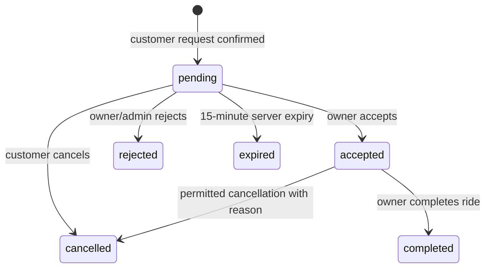

# Current application map

**Snapshot:** 6 Oct 2026. Describes the working tree, including local driver/vehicle verification and photo changes.
**Code is not proof of deployment:** read-only inspection on 5 Oct 2026 found the configured dashboard project labeled Production, but the app repo has no authenticated CLI link or migration ledger.

## User-visible areas

| Area | Current behavior | Main implementation |
|---|---|---|
| Sign-in and demo entry | Phone/password Supabase sign-in/sign-up for customer or owner; no SMS confirmation flow; demo entry switches among customer, owner, and admin and persists local sample state | `App.tsx`, `src/supabase.ts`, `src/components/Primitives.tsx` |
| Customer home and search | Local vs outstation; pickup and outstation destination use Photon autocomplete with manual entry; optional foreground location applies to pickup only; vehicle filter, date/time, local duration or outstation destination/duration | `src/screens/CustomerScreens.tsx`, `src/components/LocationPicker.tsx`, `App.tsx` |
| Results and quote | Only eligible available cabs; local hourly/full-day quote; outstation saved one-way ₹/km rate, with final fare agreed directly; rate sort; no-results recovery; optional driver and vehicle photos | `src/components/CabCard.tsx`, `src/screens/CustomerScreens.tsx`, `App.tsx` |
| Booking | Review screen, cash explanation, idempotent request attempt, server-confirmed success, booking status card, cancellation/rejection reasons, contact after acceptance via system dialer | `src/components/BookingConfirmation.tsx`, `src/components/BookingCard.tsx`, `App.tsx`, `src/cloudData.ts` |
| Owner dashboard | Driver evidence checklist, opt-in selfie display switch, vehicle cards, required RC/insurance/PUC uploads, optional vehicle-photo upload and withdrawal, expiry fields, approval/availability state, rates/hours, booking actions, optional Android push setup | `src/screens/OwnerScreens.tsx`, `src/components/BookingCard.tsx`, `src/pushNotifications.ts`, `App.tsx` |
| Admin dashboard | Review queue with file open/approve/reject, owner/vehicle approve/reject gates, block/unblock, booking status/reason and ordered history timeline, weekly counts in cloud mode; equivalent booking-history updates in demo | `src/screens/AdminScreen.tsx`, `App.tsx` |
| Language and common UI | Hindi/English switch; common mobile components/theme | `src/i18n.ts`, `src/theme.ts`, `src/components/*` |

## Core booking and approval invariants

```text
Owner is eligible
  = owner account approved AND not blocked
  AND latest Aadhaar approved AND latest selfie approved

Vehicle is eligible
  = owner eligible AND vehicle approved AND not blocked
  AND registration number valid
  AND latest RC approved and newer than a registration-number change
  AND latest insurance approved and unexpired
  AND latest PUC approved and unexpired
  AND owner has made the vehicle available for the requested time

Booking request is eligible
  = customer is active AND vehicle is eligible
  AND no accepted or unexpired pending request overlaps that cab's time slot
```

Driver display-photo opt-in and vehicle photo are presentation fields only. A pending/rejected vehicle photo does not change the eligibility expression. An approved selfie appears on customer results only when `profiles.show_driver_photo` is true. Customer display links are short-lived and are issued only for approved photos associated with currently bookable supply. Aadhaar, RC, insurance, and PUC remain private admin/owner evidence.

Required driver evidence: Aadhaar + selfie. Required vehicle evidence: RC + insurance + PUC. Optional display evidence: vehicle photo. Do not add optional photos to approval-readiness arrays.

## Booking lifecycle



The database validates transitions, snapshots fare/vehicle/owner details, maintains status history, and ignores expired pending requests for overlap checks. App refresh lazily changes stale requests to `expired`; an optional Supabase Cron job can keep the displayed status timely while all clients are idle.

## Source and system map

| Concern | Source of truth | Notes |
|---|---|---|
| Screen flow, demo fixtures, cloud orchestration | `App.tsx` | Page state, search eligibility, booking attempts, auth, uploads, review handlers, notification tap routing |
| Domain types | `src/types.ts` | Roles, cabs, booking statuses, documents, store |
| Cloud client and transformations | `src/cloudData.ts` | Supabase reads/mutations, Storage uploads and signed links, lifecycle RPCs, pilot events |
| Base relational schema | `supabase/schema.sql` | Run once on a fresh project before timestamped migrations |
| Ordered incremental schema/security changes | `supabase/migrations/*.sql` | Five local migrations at this snapshot; review/apply in timestamp order |
| Raw evidence retention worker | `supabase/functions/purge-verification-files/` | Deletes eligible private files through Storage API; deploy, secret, schedule, and monitoring remain operator setup |
| Booking notifications | `src/pushNotifications.ts`, `supabase/functions/send-booking-request/index.ts` | Expo token registration + secret-protected DB webhook target; requires external EAS/FCM/Supabase setup |
| Place lookup | `src/components/LocationPicker.tsx` | Photon public service for pickup and outstation destination suggestions; internet-dependent and without a production SLA. Manual text remains valid; no coordinates or route are stored. |
| Local persistence | AsyncStorage in `App.tsx` | Demo data only; cloud records are Supabase-backed |

### Local migrations at this snapshot

1. `20261001000100_booking_lifecycle_statuses.sql`
2. `20261001000200_pilot_booking_workflows.sql`
3. `20261003000100_driver_vehicle_verification_documents.sql`
4. `20261003000200_optional_public_vehicle_photos.sql`
5. `20261005000100_verification_evidence_retention.sql`

For a fresh database, use the tracked base schema and five migrations in a disposable project first. The configured existing Production project was initialized manually from `supabase/schema.sql`; its migration ledger was absent, and read-only inspection found the first four migrations pending. The retention migration is new in this change. Adopt and compare the manually applied baseline into Supabase migration history before deploying; do not run `db push` or paste migrations into SQL Editor blindly. CLI authentication, Docker, and a disposable project were unavailable on the snapshot date. See [EP-04 research](../research/2026-10-05-ep04-research.md) and [EP-04 plan](../plans/2026-10-05-ep04-plan.md).

### Main persisted entities

- `profiles`: role, contact, block state, owner review state, optional driver-photo visibility preference.
- `vehicles`: owner, type/capacity/rates/registration, review/block/availability state and optional India-local daily hours.
- `verification_documents`: latest/versioned file evidence, document type, owner/vehicle scope, review state, expiry/rejection metadata, private Storage path, raw-file purge and optional-photo withdrawal timestamps. Purged rows retain approval metadata; a purged selfie cannot be enabled for display again without a fresh upload.
- `bookings`: trip snapshot, request key, per-km rate snapshot, expiry, status and supported reason.
- `booking_status_history`: actor/time/reason for booking transitions.
- `push_tokens`: owner's opt-in Expo token(s).
- `pilot_events`: privacy-limited event and optional booking UUID; admin reads weekly aggregates.

## Demo coverage and limits

| Fixture / path | What it demonstrates | What it does not prove |
|---|---|---|
| Ramesh Kumar / Maruti Swift | Approved driver and vehicle; bookable positive path; approved photo placeholder; selfie display opt-in | Real identity, real vehicle photo, Storage link, customer RLS |
| Suresh Yadav / Mahindra Bolero | Missing/pending/rejected driver/vehicle evidence; rejected selfie reason; pending optional vehicle photo; disabled approval until required evidence is ready | Camera/file selection, actual private file preview, live server gates |
| Amit Patel / Maruti Dzire | Approved driver but rejected insurance; vehicle approval stays incomplete | SQL trigger/RLS enforcement against API bypass |
| Meena Devi / Tata Tigor | Expired insurance makes otherwise reviewed supply ineligible | Date/time behavior across real Android timezone settings |
| Demo owner/admin loop | Submit synthetic replacement, review/approve/reject locally, test driver-photo opt-in, remove an optional vehicle photo, verify the photo remains non-gating, and inspect booking transition history after a demo lifecycle | Supabase auth, migrations, signed URLs, retention worker schedule, push, external geocoder uptime |

Demo file paths are synthetic. The photo preview is a placeholder, not a real photograph. Real camera and document selection are cloud-only. Treat demo as a workflow/presentation fixture, not as an integration test.

## Known gaps and rollout dependencies

- The original source PRD is referenced by an earlier review but not present in the repo; see [product handoff](README.md).
- The configured Production project is missing the EP-04 schema and migration ledger as of 5 Oct 2026; actual live RLS/Storage behavior therefore does not yet support EP-04. CLI access and a disposable validation project are not available in this checkout.
- Phone/password accounts do not verify phone ownership. Password recovery and impersonation handling are not implemented; define human support before public launch.
- No stand contact/help or customer incident-reporting destination is configured. Support cannot be promised from the app.
- Review the proposed evidence-retention windows and validate/deploy the server-side purge worker before collecting real Aadhaar or other identity files; the local worker is unscheduled and legal/privacy review remains required.
- Android push needs EAS project ID, FCM V1 credentials, deployed Edge Function, secret, Database Webhook, and device validation. Expo Go is not a push validation target.
- Photon public endpoint has no SLA. Choose a managed or hosted geocoder before public traffic.
- Date and time are plain text. Overnight availability windows are unsupported. Validate schedule behavior on Android in the pilot town.
- App, SQL, and push/runtime behavior have not been jointly validated against a disposable Supabase project in this workspace.
- The app permits account creation but has no in-app closure flow or external deletion page. The current booking foreign keys can prevent deletion of profiles/vehicles with booking history, while booking snapshots retain names and trip places; a reviewed server-side anonymization/deletion workflow is required before release.
- EAS development, preview, and production profiles plus the EAS project ID are configured. The Android main-branch build workflow requires the GitHub Actions `EXPO_TOKEN` repository secret before it can queue builds; no signed EAS production artifact has been verified. App icon/splash assets are still missing. Expo Doctor recommends upgrading SDK 56 to SDK 57 and aligning TypeScript before release.
- See the [6 Oct market-readiness audit](../research/2026-10-06-market-readiness-audit.md) and [EP-08 launch plan](../plans/2026-10-06-market-readiness-plan.md) for the ordered release path.
